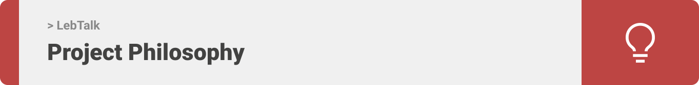
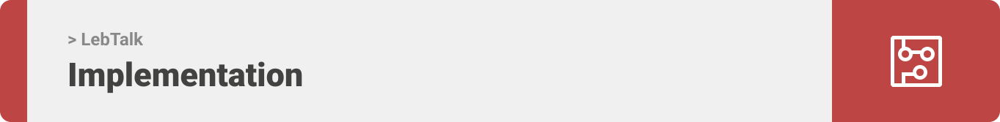

<div align="center">

> Hello world! This is the project’s summary that describes the project plain and simple, limited to the space available. 

**[PROJECT PHILOSOPHY](https://github.com/Fatima-Kabalan/LebTalk/tree/develop#-project-philosophy) • [WIREFRAMES](https://github.com/Fatima-Kabalan/LebTalk/tree/develop#-mockups) • [TECH STACK](https://github.com/Fatima-Kabalan/LebTalk/tree/develop#-tech-stack) • [IMPLEMENTATION](https://github.com/Fatima-Kabalan/LebTalk/tree/develop#-impplementation) • [HOW TO RUN?](https://github.com/Fatima-Kabalan/LebTalk/tree/develop#-how-to-run)**

</div>

<br><br>




> The LebTalk app is a learning app that teaches the user how to speak arabic lebanese by listnening to audio and seeing the translate of words in both languages .
> 
> There are several questions for each quiz for each category inorder to make the user practice his new language.

### User Stories
- As a user, I want to learn lebanese in a fast way, so that I can benifit from it
- As a user, I want to listen to audio that teaches me the words spelling correctly
- As a user, I want to be able to favorite cards that I like the most 
- As a user, I want to be able to do a quiz game inorder to make sure that I've learned well
- As a user, I want to be able to see my score 
- As a user, I want to chat with instructors that can help me out if I didn't understand the app well
<br><br>

### Admin Stories
- As an admin, I want to be able to add categories,cards,questions,answers
- As an admin, I want to be able to add instructors that help users
- As an admin, I want to be able to see all the users that logged in 
- As an admin, I want to be able to see all the categories,cards,questions,answers,instructors found in the app 
<br><br>


> This design was planned before on paper, then moved to Figma app for the fine details.
Note that i didn't use any styling library or theme, all from scratch and using pure css modules

| Landing  | Home  || Food Category  | Question Page  |
| -----------------| -----|
|  |  | |  |


| Food Category  | Question Page  |
| -----------------| -----|
|  |  |


<br><br>


Here's a brief high-level overview of the tech stack the Well app uses:

-Frontend: This project uses the <a href="https://reactnative.dev/">React Native framework</a> for the mobile application along side with ReactJS for the desktop app. React (also known as React.js or ReactJS) is a free and open-source front-end JavaScript library for building user interfaces based on UI components. while React Native is used to develop applications for Android, Android TV, iOS, macOS, tvOS, Web, Windows and UWP by enabling developers to use the React framework along with native platform capabilities. For the development environment, Expo CLI was used.

-The backend is implemented using <a href="https://laravel.com/">Laravel</a> which is a free and open-source PHP web framework, intended for the development of web applications following the model–view–controller (MVC) architectural pattern and based on Symfony.

-For persistent storage (database), the app uses <a href="https://www.mysql.com/">MySQL</a>. MySQL is a relational database management system based on SQL – Structured Query Language.


<br><br>


> Uing the above mentioned tecch stacks and the mockups build with figma from the user sotries we have, the implementation of the app is shown as below, these are screenshots from the real app

| Landing  | Home  |
| -----------------| -----|
|  |  |

<br><br>


> This is an example of how you may give instructions on setting up your project locally.
To get a local copy up and running follow these simple example steps.

### Prerequisites

Download and Install <a href="https://nodejs.org/en/">Node.js</a>

Download and Install <a href="https://getcomposer.org/download/">Composer</a>

Download and Install <a href="https://www.apachefriends.org/download.html">XAMPP</a>

* npm
  ```sh
  npm install npm@latest -g
  ```
* Expo Cli
  ```sh
  npm install --global expo-cli
  ```

### Installation

_Below is an example of how you can instruct your audience on installing and setting up your app. This template doesn't rely on any external dependencies or services._

1. Clone the repo
   ```sh
   git clone https://github.com/Fatima-Kabalan/LebTalk.git
   ```
-To Run The Mobile App

1. Navigate to the Frontend folder then ReactNative folder and install dependencies
   ```sh
    cd LebTalk/frontend/
    npm install
   ```
2. Run the start up command
    ```sh
        expo start
    ```
3. Scan the generated QR code with your camera (ios) or through the Expo Go application (android)

-To Run Laravel Server on your machine

1. Create a database locally named lebtalkdb

2. Navigate to the backend folder
    ```sh
        cd LebTalk/backend
    ```
3. Inside the .env file in your backend folder
   Insert the db name as follow -> DB_DATABASE= -> DB_DATABASE=lebtalkdb

4. Run migration
    ```sh
        php artisan migrate
    ```
5. Run the seeder
    ```sh
        php artisan db:seed
    ```
6. Start the Server
    ```sh
        php artisan serve
    ```

