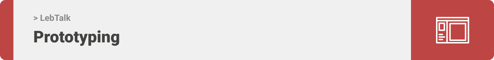
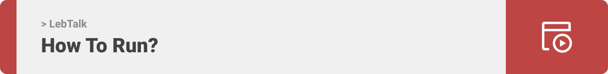

<div align="center">

> Hello world! This is the project’s summary that describes the project plain and simple, limited to the space available. 

**[PROJECT PHILOSOPHY](https://github.com/Fatima-Kabalan/LebTalk/tree/develop#-project-philosophy) • [WIREFRAMES](https://github.com/Fatima-Kabalan/LebTalk/tree/develop#-mockups) • [TECH STACK](https://github.com/Fatima-Kabalan/LebTalk/tree/develop#-tech-stack) • [IMPLEMENTATION](https://github.com/Fatima-Kabalan/LebTalk/tree/develop#-impplementation) • [HOW TO RUN?](https://github.com/Fatima-Kabalan/LebTalk/tree/develop#-how-to-run)**

</div>

<br><br>


> The LebTalk app is a learning app that teaches the user how to speak arabic lebanese by listnening to audio and seeing the translate of words in both languages .
> 
> There are several questions for each quiz for each category inorder to make the user practice his new language.

### User Stories
- As a user, I want to learn lebanese in a fast way, so that I can benifit from it
- As a user, I want to get notifications for having new categories added, so that I can check it quickly 
<br><br>



> This design was planned before on paper, then moved to Figma app for the fine details.
Note that i didn't use any styling library or theme, all from scratch and using pure css modules

| Landing  | Home  |
| -----------------| -----|
|  |  |

| Food Category  | Question Page  |
| -----------------| -----|
|  |  |

| Connect to instructors  |   
| -----------------|
|  | 


<br><br>


Here's a brief high-level overview of the tech stack the Well app uses:

-Frontend: This project uses the <a href="https://reactnative.dev/">React Native framework</a> for the mobile application along side with ReactJS for the desktop app. React (also known as React.js or ReactJS) is a free and open-source front-end JavaScript library for building user interfaces based on UI components. while React Native is used to develop applications for Android, Android TV, iOS, macOS, tvOS, Web, Windows and UWP by enabling developers to use the React framework along with native platform capabilities. For the development environment, Expo CLI was used.
-The backend is implemented using Laravel which is a free and open-source PHP web framework, intended for the development of web applications following the model–view–controller (MVC) architectural pattern and based on Symfony.
-For persistent storage (database), the app uses MySQL. MySQL is a relational database management system based on SQL – Structured Query Language.


<br><br>


> Uing the above mentioned tecch stacks and the mockups build with figma from the user sotries we have, the implementation of the app is shown as below, these are screenshots from the real app

| Landing  | Home/Search  |
| -----------------| -----|
|  |  |


<br><br>



> This is an example of how you may give instructions on setting up your project locally.
To get a local copy up and running follow these simple example steps.

### Prerequisites

This is an example of how to list things you need to use the software and how to install them.
* npm
  ```sh
  npm install npm@latest -g
  ```

### Installation

_Below is an example of how you can instruct your audience on installing and setting up your app. This template doesn't rely on any external dependencies or services._

1. Get a free API Key at [https://example.com](https://example.com)
2. Clone the repo
   ```sh
   git clone https://github.com/your_username_/Project-Name.git
   ```
3. Install NPM packages
   ```sh
   npm install
   ```
4. Enter your API in `config.js`
   ```js
   const API_KEY = 'ENTER YOUR API';
   ```


